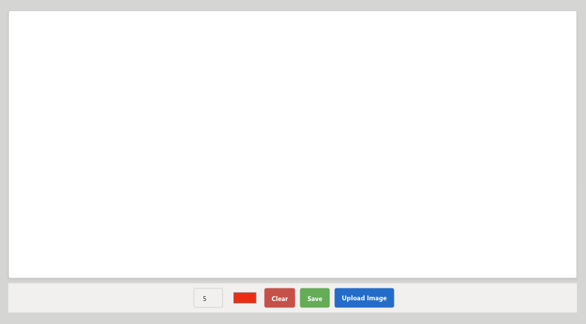
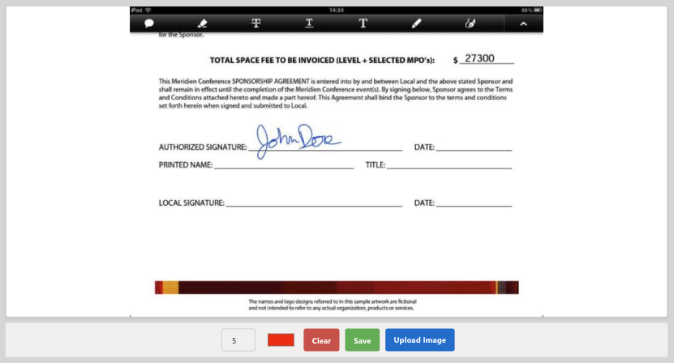

# Draw

A custom PowerApps Component Framework (PCF) control developed by **Shaheer Ahmad**.

## Description

The **Draw** component allows users to sketch or sign directly within a Power App. It supports various features like saving signatures, background images, and file management.

## Preview

### Default State

### Signing Document

## Download

[Download Solution (Managed)](Solutions/PCFDraw_1_0_0_1_managed.zip)

## Features

-   **Drawing Canvas**: Freehand drawing capability.
-   **Background Support**: Set a custom background image (`CanvasBackground`).
-   **Save & Load**: Save drawings (`SavedImage`) and load default images.
-   **File Options**: Enable download/upload functionality (`EnableDownload`, `EnableUpload`).

## Installation

### Prerequisites
1.  Go to **Power Platform Admin Center** > **Environments** > Select your environment.
2.  Go to **Settings** > **Product** > **Features**.
3.  Ensure **Power Apps component framework for canvas apps** is enabled.

### Steps
1.  **Download**: Download the solution file linked above.
2.  **Import Solution**:
    -   Go to [make.powerapps.com](https://make.powerapps.com/).
    -   Select **Solutions** from the left navigation.
    -   Click **Import solution** and select the downloaded zip file.
    -   Follow the prompts to complete the import.
3.  **Add to Canvas App**:
    -   Open your Canvas App in the editor.
    -   Select **Insert** (plus icon) from the left sidebar.
    -   Click **Get more components** at the bottom of the pane.
    -   Go to the **Code** tab.
    -   Select **Draw** and click **Import**.

## Usage

1.  **Add Component to Screen**:
    -   Expand the **Code components** section in the **Insert** pane.
    -   Drag and drop the **Draw** component onto your screen.
2.  **Configure Properties**:
    -   **CanvasBackground**: (Text) URL or base64 string for the background image.
    -   **FileName**: (Text) Default name for the file when downloaded.
    -   **EnableDownload**: (Boolean) Set to `true` to show the download button (save icon).
    -   **EnableUpload**: (Boolean) Set to `true` to show the upload button (upload icon).
    -   **EnableClear**: (Boolean) Set to `true` to show the clear button (trash icon).
    -   **PenColor**: (Color) Set the color of the drawing pen.
3.  **Save Output**:
    -   The drawing output is available in the `SavedImage` property (Base64).

## Creator

**Shaheer Ahmad**
-   GitHub: [shaheerahmadch](https://github.com/shaheerahmadch)

## License

This project is licensed under the MIT License.
